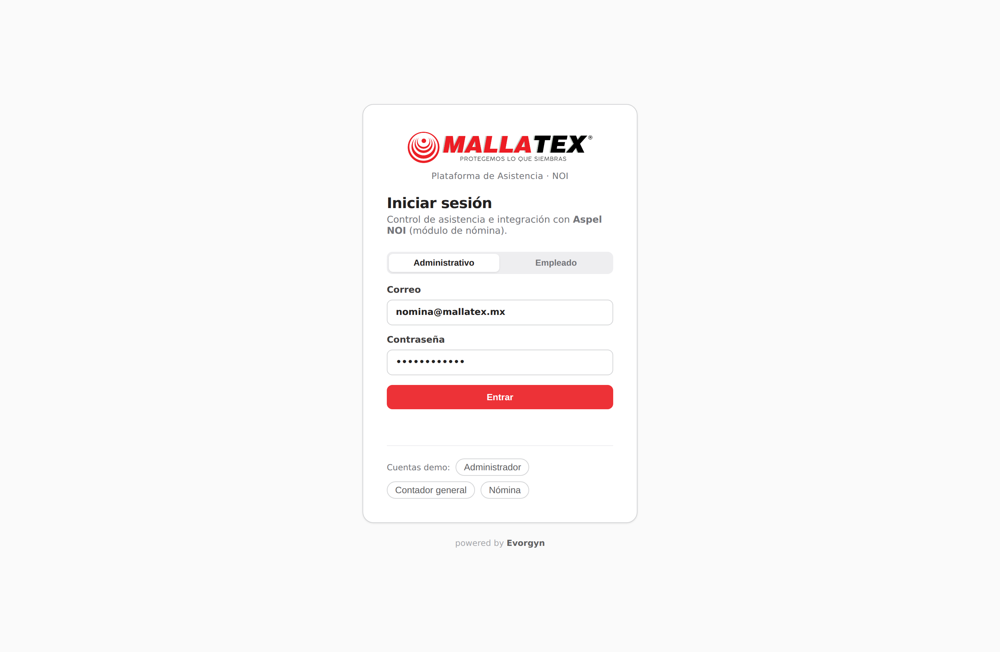
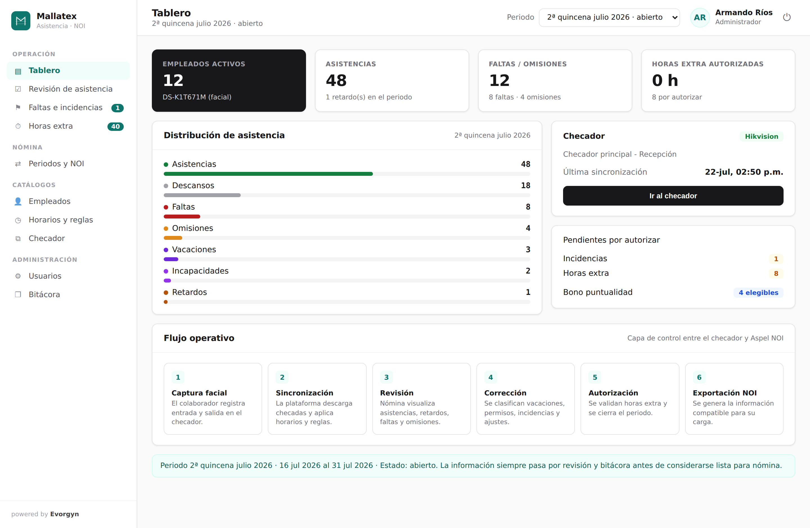
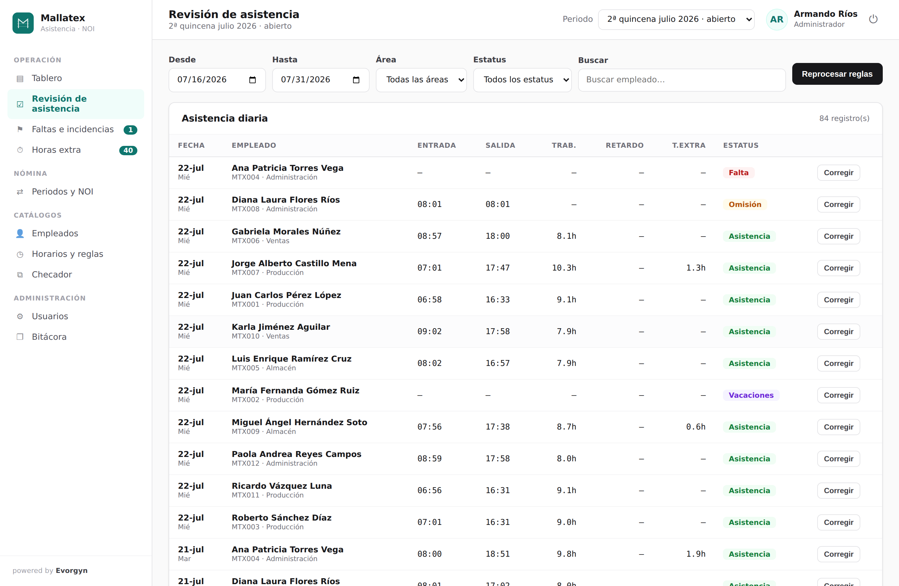
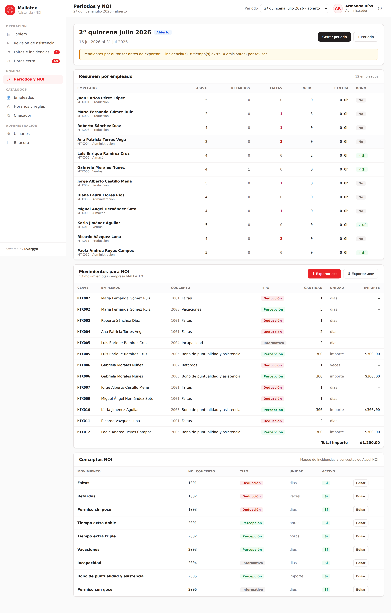
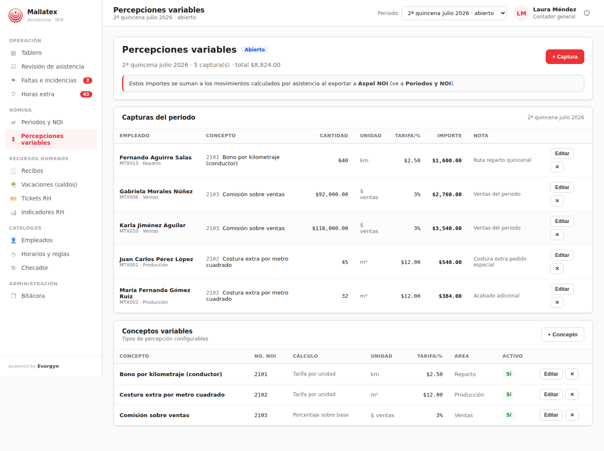

# Mallatex — Plataforma de Control de Asistencia e Integración con Aspel NOI

Sistema de asistencia de **Mallatex**: una capa de control entre el **checador facial
(Hikvision)** y **Aspel NOI** —el módulo de nómina del ERP de Aspel— que revisa y valida
la información de asistencia **antes** de generar los movimientos de nómina.

> Meta del proyecto: *revisar y validar la información del checador antes de generar los
> movimientos de nómina*. La plataforma **no** envía registros crudos a Aspel NOI:
> consolida la información ya revisada y autorizada del periodo.

<p align="center"><i>Julio 2026 · Implementación progresiva — powered by <b>Evorgyn</b></i></p>

---

## 🖼️ Capturas

Las imágenes de la aplicación están en [`docs/screenshots/`](docs/screenshots/):

| | |
|---|---|
|  |  |
| Acceso | Tablero |
|  |  |
| Revisión de asistencia | Periodos y exportación NOI |

## 📖 Manual de usuario

Manual completo con todas las pantallas y funcionalidades:

- **PDF:** [`docs/Manual_Mallatex_Plataforma_Asistencia.pdf`](docs/Manual_Mallatex_Plataforma_Asistencia.pdf)
- **Word:** [`docs/Manual_Mallatex_Plataforma_Asistencia.docx`](docs/Manual_Mallatex_Plataforma_Asistencia.docx)

Cómo regenerarlo: ver [`docs/manual/`](docs/manual/).

## 🎯 Alcance implementado

La aplicación cubre el **alcance inicial** completo descrito en la propuesta:

| # | Módulo de la propuesta | Implementación |
|---|------------------------|----------------|
| 1 | **Integración con checador** | Dispositivo Hikvision con descarga (sincronización) de checadas. |
| 2 | **Catálogo de empleados** | Alta/edición, mapeo con clave NOI e ID del checador. |
| 3 | **Horarios y reglas** | Turnos, tolerancias, umbral de retardo/falta, días laborables y reglas globales. |
| 4 | **Revisión de asistencia** | Vista diaria/por periodo con estatus calculado por reglas. |
| 5 | **Faltas e incidencias** | Vacaciones, permisos (con/sin goce), incapacidad, faltas justificadas, festivos. |
| 6 | **Retardos y bonos** | Cálculo de retardos y elegibilidad de bono de puntualidad/asistencia. |
| 7 | **Horas extra** | Cálculo preliminar, revisión y **autorización** de tiempo extra. |
| 8 | **Exportación a NOI** | Movimientos mapeados a conceptos NOI y archivo de interfaz (.txt / .csv). |

Además, transversalmente:

- **Capa de revisión y bitácora**: cada ajuste queda registrado con **usuario, fecha y motivo** (trazabilidad).
- **Usuarios y roles**: Administrador, Contador general y Responsable de nómina (hasta 5 usuarios administrativos, plan *Renta Operativa*).
- **Cierre de periodo**: exige autorizar los movimientos pendientes y bloquea correcciones posteriores.

## 💲 Percepciones variables (kilometraje, costura por m², comisiones)

Además de la asistencia, la plataforma administra **percepciones que no dependen del
reloj** sino de una cantidad capturada por periodo. Cada tipo de pago es un **concepto
configurable** con su número de Aspel NOI y su forma de cálculo:

| Caso de uso | Concepto | Cálculo | Ejemplo |
|-------------|----------|---------|---------|
| **Conductor** — pago por kilometraje | Bono por kilometraje | `cantidad × tarifa` | 640 km × $2.50 = **$1,600** |
| **Operador de producción** — costura extra | Costura extra por m² | `cantidad × tarifa` | 45 m² × $12 = **$540** |
| **Vendedor** — comisión | Comisión sobre ventas | `base × %` | $92,000 × 3 % = **$2,760** |

- **Catálogo de conceptos**: modo de cálculo (`tarifa por unidad`, `porcentaje sobre base`
  o `importe directo`), unidad, tarifa/porcentaje por defecto, número de concepto NOI y área.
- **Captura por periodo** (*Nómina → Percepciones variables*): se registra la cantidad por
  empleado; el importe se calcula en vivo. Se admite una **tarifa/porcentaje distinto por
  empleado** (excepción puntual) sin cambiar el concepto.
- **Integración con NOI**: estos importes se suman a los movimientos calculados por
  asistencia y viajan en la misma interfaz de exportación (`.txt` / `.csv`).
- Sólo se capturan en **periodos abiertos**; al cerrar el periodo quedan bloqueadas.

### Fuente de datos por concepto (conectores)

Es **un solo módulo configurable**: cada concepto declara su **fuente de datos**. Hoy la
captura es **manual**; en una fase posterior cada fuente externa se **sincroniza
automáticamente** —igual que la descarga del checador Hikvision está simulada hoy y en
producción usaría ISAPI/SDK. La capa de conectores vive en
[`server/connectors.js`](server/connectors.js) (sincronización simulada, lista para
conectar la API real):

| Fuente | Alimenta | Origen en producción (fase posterior) |
|--------|----------|----------------------------------------|
| **G3** | Kilometraje del conductor | Telemetría de flotilla (G3 Drive) |
| **MES** | m² de costura en fabricación | Plataforma MES (órdenes de producción) |
| **Aspel** | Base de comisión de ventas | Aspel (CxC/SAE) al confirmarse el **pago de facturas** |

Cada captura guarda su **origen** (`Manual` / `G3` / `MES` / `Aspel`) para trazabilidad, y
la sincronización hace *upsert* por identificador externo (re-sincronizar **actualiza**, no
duplica) sin tocar las capturas manuales.

> **Contratos de integración** (Hikvision, G3, MES, Aspel CxC y exportación NOI), con
> payloads y puntos de implementación en el código: [`docs/integraciones.md`](docs/integraciones.md).



## 📷 Reconocimiento facial por cámara (modo kiosco)

El registro de entrada/salida del empleado se hace por **reconocimiento facial con la
cámara frontal de una tablet o una webcam**, 100 % en el navegador y **sin conexión a
servicios externos** (modelos de [`@vladmandic/face-api`](https://github.com/vladmandic/face-api)
servidos localmente desde `public/models`).

- **Enrolamiento:** en *Empleados → 📷 Registrar* se captura el rostro y se genera una
  plantilla facial (descriptor de 128 valores) que se guarda en el empleado.
- **Kiosco (`/kiosk`):** muestra la cámara en vivo, detecta el rostro, calcula su
  descriptor y lo compara (distancia euclidiana, umbral 0.5) contra los rostros
  enrolados. Al identificar, registra la checada y muestra la confirmación.
- **Respaldo:** si no hay cámara disponible, ofrece registro manual.

> La cámara del navegador requiere **contexto seguro**: funciona en `localhost` o sobre
> **HTTPS**. Para una tablet en red local, sirve la plataforma por HTTPS. La
> identificación en el dispositivo Hikvision físico seguiría su propio flujo por ISAPI/SDK.

## 🔄 Flujo operativo (tal como en la propuesta)

```
1. Captura facial → 2. Sincronización → 3. Revisión → 4. Corrección → 5. Autorización → 6. Exportación NOI
```

1. **Captura facial** — el colaborador registra entrada/salida en el checador.
2. **Sincronización** — la plataforma descarga checadas y aplica horarios y reglas.
3. **Revisión** — Nómina visualiza asistencias, retardos, faltas y omisiones.
4. **Corrección** — se clasifican vacaciones, permisos, incidencias y ajustes.
5. **Autorización** — se validan horas extra y se cierra el periodo.
6. **Exportación NOI** — se genera la información compatible para su carga.

## 🚀 Puesta en marcha

Requiere **Node.js ≥ 20**.

```bash
cd mallatex-asistencia
npm install
npm start
```

Abre <http://localhost:3000>. En el primer arranque se cargan automáticamente los
**datos demostrativos de Mallatex** (13 empleados —incluido un conductor de reparto—,
3 turnos, checador Hikvision, ~6 semanas de checadas simuladas, dos periodos de nómina
y capturas de percepciones variables de ejemplo).

Para reiniciar los datos:

```bash
npm run seed   # node server/seed.js --reset
```

### 🚀 Producción

Para salir a producción, sigue la **[guía de despliegue (`DEPLOY.md`)](DEPLOY.md)** y el
**[checklist de go-live (`docs/go-live-checklist.md`)](docs/go-live-checklist.md)**.
Para **Windows Server** (IIS + PostgreSQL como servicio), ver
**[`docs/instalacion-windows-server.md`](docs/instalacion-windows-server.md)**. En resumen:

```bash
cp .env.example .env          # ajusta admin, dominio y TLS
docker compose up -d --build  # app + reverse-proxy nginx (TLS)
```

Con `NODE_ENV=production` y `SEED_DEMO=false` **no** se cargan datos demostrativos: se
crean los catálogos base y el **primer administrador** desde `BOOTSTRAP_ADMIN_*`. La
plataforma se ejecuta **detrás de un reverse-proxy con TLS** (la cámara del kiosco exige
HTTPS). Incluye endurecimiento listo para producción:

- Contraseñas con **scrypt** y **PIN cifrado**; **sesiones con caducidad**; **límite de
  intentos de acceso**.
- **Cabeceras de seguridad** (CSP con nonce, HSTS, `X-Frame-Options`, `Permissions-Policy`…)
  y CORS configurable.
- **Configuración por entorno** ([`.env.example`](.env.example)), **respaldos** con rotación,
  **health/ready checks**, **apagado ordenado** y **candado de instancia única**.
- Empaquetado en **[`Dockerfile`](Dockerfile)** + **[`docker-compose.yml`](docker-compose.yml)**
  (usuario no-root, HEALTHCHECK, volumen de datos). Integración continua en
  [`.github/workflows/ci.yml`](.github/workflows/ci.yml).

> **Persistencia conmutable**: `STORAGE=postgres` (**PostgreSQL**, recomendado en
> producción, con bloqueo de escritor único vía `pg_advisory_lock`) o `STORAGE=file`
> (archivo JSON, una sola instancia). Migración incluida: `npm run migrate:pg`. Ver
> *DEPLOY.md* §2.1.

### Cuentas demo (contraseña: `mallatex2026`)

| Rol | Correo | Puede |
|-----|--------|-------|
| Administrador | `admin@mallatex.mx` | Todo, incluida gestión de usuarios y reglas. |
| Contador general | `contabilidad@mallatex.mx` | Autorizar incidencias/horas extra, catálogos, cierre. |
| Responsable de nómina | `nomina@mallatex.mx` | Revisión, corrección, incidencias, horas extra, exportación. |

## 🧠 Motor de reglas

A partir de las checadas y el horario del empleado, cada día se clasifica en:
`asistencia`, `retardo`, `falta`, `omisión` (una sola checada), `descanso`,
`vacaciones`, `permiso`, `incapacidad`, `justificada` o `festivo`.

- **Tolerancia**: minutos de gracia antes de contar retardo.
- **Retardo → falta**: si el retraso supera el umbral del turno, se marca como falta.
- **Tiempo extra**: minutos trabajados después de la salida programada (con umbral y bloque mínimo).
- **Bono de puntualidad/asistencia**: elegible si no excede los retardos permitidos ni tiene faltas/omisiones.

Las incidencias **autorizadas** tienen prioridad sobre el cálculo automático. Las
correcciones manuales se conservan al reprocesar y quedan marcadas como `✎ manual`.

## 📤 Exportación a NOI

La plataforma genera un **archivo de interfaz** (`.txt` delimitado por `|` o `.csv`)
con los movimientos del periodo, mapeados a **conceptos configurables de Aspel NOI**:

```
CLAVE|CONCEPTO|TIPO|DESCRIPCION|UNIDAD|CANTIDAD|IMPORTE|REFERENCIA
MTX002|1001|D|Faltas|dias|1|0|1 día(s)
MTX002|2003|P|Vacaciones|dias|5|0|vacaciones
MTX005|2005|P|Bono de puntualidad y asistencia|importe|300|300|bono íntegro
```

La exportación **se bloquea** si quedan incidencias u horas extra sin autorizar
(puede forzarse de forma explícita). Los conceptos NOI son editables desde la interfaz.

## 🏗️ Arquitectura

```
mallatex-asistencia/
├── server/                 # Backend (Node.js + Express, sin dependencias nativas)
│   ├── index.js            # Bootstrap: API + frontend estático
│   ├── db.js               # Persistencia (archivo JSON, por colecciones)
│   ├── auth.js             # Autenticación por token + roles
│   ├── audit.js            # Bitácora / trazabilidad
│   ├── rules.js            # Motor de reglas de asistencia
│   ├── checador.js         # Integración/sincronización Hikvision (simulada)
│   ├── connectors.js       # Fuentes de percepciones variables (G3/MES/Aspel, simuladas)
│   ├── noi.js              # Conceptos y generación de interfaz NOI
│   ├── seed.js             # Datos demostrativos de Mallatex
│   └── routes/             # auth · catalog · operations · periods · audit
└── public/                 # Frontend SPA (JavaScript modular, sin build)
    ├── index.html
    ├── css/styles.css
    └── js/                 # api · state · router · ui + views/
```

**Backend**: API REST con Express y una capa de persistencia en archivo JSON
organizada por colecciones (fácilmente migrable a un motor SQL). Autenticación por
token con roles y bitácora de cada operación.

**Frontend**: SPA en JavaScript modular (ES Modules, sin paso de compilación),
servida por el propio servidor. Diseño minimalista con la identidad corporativa de Mallatex.

### 🎨 Identidad de marca

Colores corporativos **exactos**, tomados del logotipo oficial de Mallatex
(*"Protegemos lo que siembras"*):

Tomados del **Manual de Identidad Corporativa Mallatex 2023**:

| Color | Hex | RGB | Uso |
|-------|-----|-----|-----|
| Rojo Mallatex | `#ED3237` | 237,50,55 | Acento principal: botones, navegación activa |
| Rojo oscuro | `#9B3234` | 155,50,52 | Degradado / estados presionados |
| Negro Mallatex | `#232121` | 35,33,33 | Texto principal y tarjetas destacadas |
| Gris | `#606062` | 96,96,98 | Texto secundario |
| Gris claro | `#D2D3D5` | 210,211,213 | Líneas y divisores |

Se usa el **logotipo oficial** de Mallatex (imagotipo e isotipo).

### Sobre la integración con hardware y NOI

Este proyecto es una **implementación funcional/prototipo** del alcance de la propuesta.
La descarga de checadas del dispositivo Hikvision está **simulada** (genera eventos
realistas a partir de los horarios) para poder demostrar el flujo completo sin hardware;
en una implementación productiva, `server/checador.js` consultaría el dispositivo vía
**ISAPI/SDK Hikvision**, y la exportación se ajustaría al layout exacto de la interfaz
de **Aspel NOI** del cliente. El resto de la plataforma es agnóstico al origen de los datos.

## 🛣️ Etapa siguiente (crecimiento por módulos)

Conforme a la propuesta, sobre esta base pueden habilitarse después:
portal del empleado, recibos de nómina, vacaciones autoservicio, tickets de RH,
reportes ampliados y tableros ejecutivos.

---

<p align="center"><b>Mallatex</b> — Plataforma de Asistencia · Aspel NOI · <i>powered by Evorgyn</i></p>
