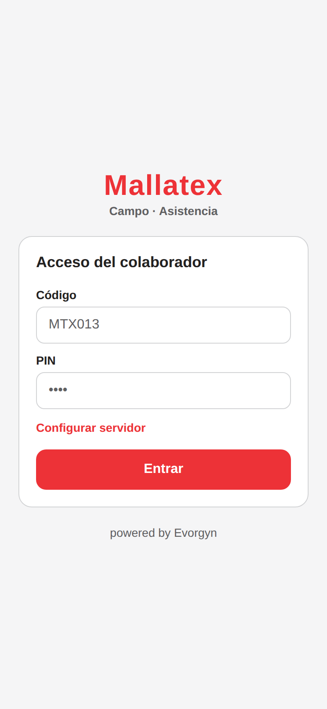
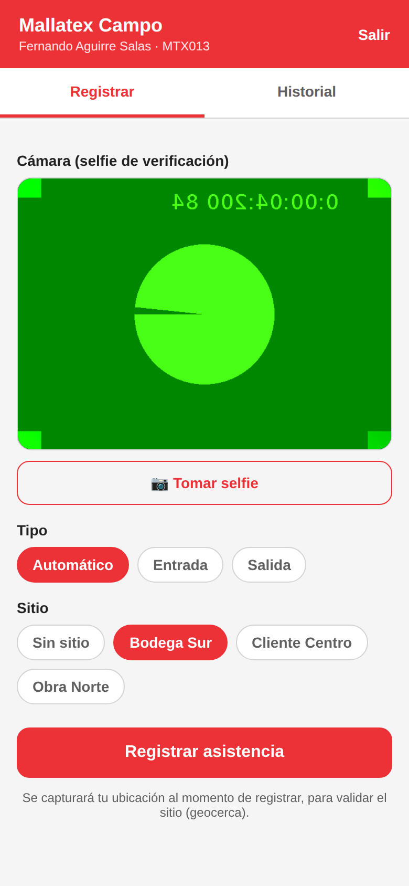
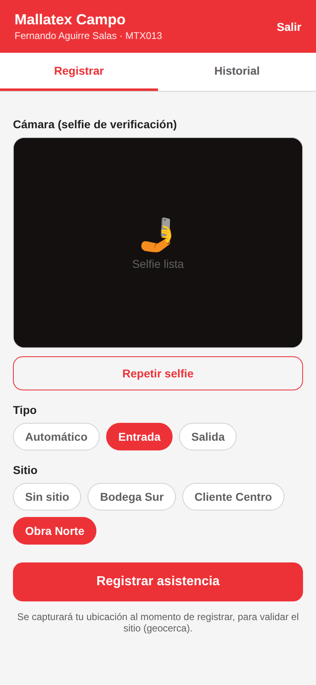
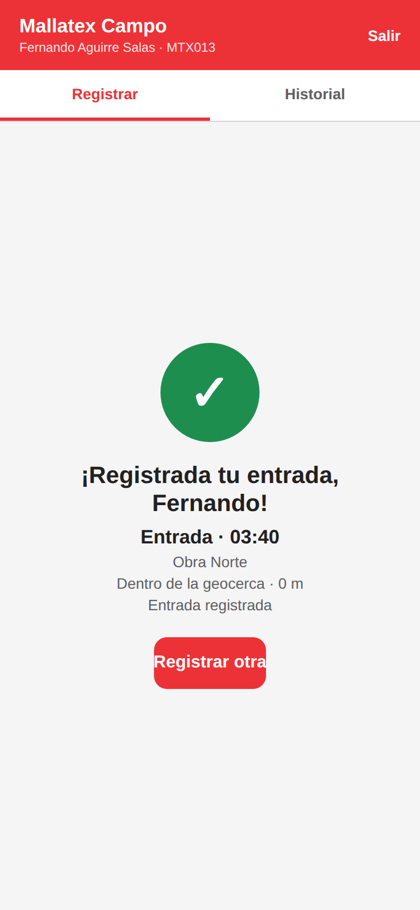
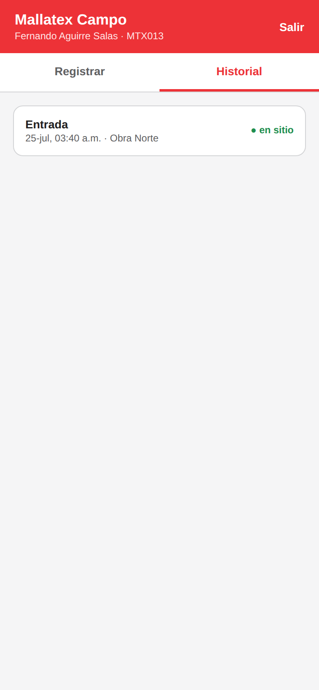

# Mallatex Campo — App móvil nativa de asistencia remota

App **nativa** (iOS/Android) para el **personal de campo**, construida con **React Native +
Expo**. Es un **módulo aparte**: la aplicación web no cambia. Se conecta al **mismo backend**
(endpoints `/api/auth` y `/api/field/*`), por lo que las checadas de campo entran al mismo
motor de reglas y a la exportación a **Aspel NOI**.

> React Native compila a una app **nativa real** (no es un WebView ni una PWA): un solo
> código para iOS y Android.

## Capturas

| Acceso | Registro | Selfie |
|---|---|---|
|  |  |  |

| Confirmación (geocerca validada) | Historial |
|---|---|
|  |  |

> Capturas del flujo real (acceso → registro con selfie + GPS → validación de geocerca →
> historial), tomadas contra el backend con datos demo.

## Funcionalidades

- **Acceso del colaborador** con código + PIN (misma cuenta del portal).
- **Registro de entrada/salida** desde el campo con:
  - **Selfie** (cámara frontal) como evidencia de identidad.
  - **Ubicación GPS** validada contra la **geocerca** del sitio (dentro/fuera + distancia).
  - **Hora del servidor** (no la del teléfono).
  - Detección de **ubicación simulada** (mock).
- **Modo sin conexión**: si no hay señal, el registro se **guarda y se sincroniza** al
  reconectar (cola local + botón de sincronizar).
- **Historial** de tus registros con estado de geocerca.

## Requisitos

- **Node.js ≥ 18** y la CLI de Expo (`npx expo`).
- La app de **Expo Go** en tu teléfono (para probar), o **EAS Build** (para generar el
  instalable nativo `.apk`/`.ipa`).
- El **backend** (`mallatex-asistencia`) corriendo y accesible desde el teléfono.

## Puesta en marcha (pruebas con Expo Go)

```bash
cd mallatex-movil
npm install
# alinea las versiones de los módulos nativos con el SDK de Expo:
npx expo install expo-camera expo-location expo-secure-store @react-native-async-storage/async-storage expo-status-bar
npx expo start
```

Escanea el QR con **Expo Go**. En la pantalla de acceso, toca **“Configurar servidor”** y
pon la URL del backend:

- **Emulador Android:** `http://10.0.2.2:3000`
- **Teléfono físico (misma red Wi‑Fi):** `http://IP-DE-TU-PC:3000`
- **Producción:** `https://tu-dominio` (o `https://tu-app.onrender.com`)

Entra con una cuenta de campo de la demo: código **`MTX013`**, PIN **`1234`**.

> La cámara y el GPS requieren **permisos** (se piden en la app) y, para el GPS de alta
> precisión, tener la ubicación activada. Sobre datos móviles/producción usa **HTTPS**.

## Generar el instalable nativo (producción)

Con **EAS Build** (requiere una cuenta gratuita de Expo):

```bash
npm install -g eas-cli
eas login
eas build:configure
eas build -p android --profile preview   # genera un .apk instalable
eas build -p ios --profile preview       # requiere cuenta de Apple Developer
```

Publica el `.apk` internamente o súbelo a Play Store / App Store.

## Estructura

```
mallatex-movil/
├── App.js                      # Navegación, sesión y sincronización offline
├── app.json                    # Config Expo, permisos (cámara/ubicación), identidad
├── src/
│   ├── api.js                  # Cliente REST (/api/auth, /api/field/*)
│   ├── config.js               # URL del servidor por defecto
│   ├── storage.js              # Token (SecureStore) + cola offline (AsyncStorage)
│   ├── theme.js                # Colores corporativos Mallatex
│   └── screens/
│       ├── LoginScreen.js
│       ├── CheckinScreen.js    # Cámara + GPS + geocerca + envío/cola
│       └── HistoryScreen.js
```

## Backend que consume (ya implementado)

- `POST /api/auth/login` — acceso del empleado (código + PIN).
- `GET  /api/field/me` — perfil de campo + sitios permitidos + últimos registros.
- `GET  /api/field/sites` — sitios (geocercas) del colaborador.
- `POST /api/field/checkin` — registra entrada/salida con GPS/geocerca y evidencia.
- `GET  /api/field/checkins` — historial de registros de campo.

Los sitios/geocercas se administran en el backend (colección `sites`, API `/api/sites`).

## Verificación facial (fase 2)

Esta versión captura la **selfie como evidencia** y confía la identidad al acceso con
código + PIN, más la geocerca. La **coincidencia facial en el dispositivo** (comparar el
rostro contra el enrolado) es la **fase 2**: se integra con un módulo nativo de visión
(`react-native-vision-camera` + MLKit / un modelo on-device) que calcula el descriptor y lo
envía a `/api/field/checkin` (el backend ya acepta el campo `descriptor` y lo compara contra
el rostro enrolado del empleado). Requiere un *build* nativo (no Expo Go).

---

**Mallatex** — Asistencia de campo · *powered by Evorgyn*
